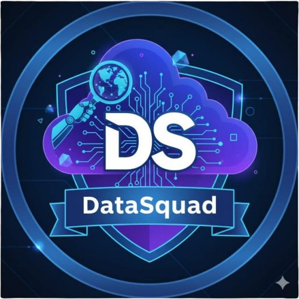

# API 2026 - DATASQUAD: Sistema de Gestão Acadêmica

Faculdade de Tecnologia de São José dos Campos - Professor Jessen Vidal

#   

            <h2 align="center"> Data Squad </h2>
  

  | <a href ="#desafio"> Desafio</a>  |  <a href ="#solucao"> Solução</a>  |     <a href ="#backlog"> Backlog do Produto</a>|     <a href ="#sprintbacklog"> Sprint Backlog </a>  |  <a href ="#sprint"> Cronograma de Sprints</a>  |  <a href ="#tecnologias">Tecnologias</a> |  <a href ="#link">Link para Documentação</a>  |   <a href ="#equipe"> Equipe</a> |
  

> Status do Projeto: A iniciar...

## Desafio 

A comunicação e o trâmite documental entre a UG FUSEX (Exército) e as OCS/PSA (clínicas, hospitais e profissionais da área de saúde) ainda depende, em grande parte, de processos manuais e desconexos, desde a emissão do pedido médico até o faturamento. Essa fragmentação eleva o risco de erros de preenchimento, retrabalho e inconsistências no faturamento, além de dificultar o rastreamento de todo o processo.

## Solução 

Para enfrentar esse cenário, propomos o desenvolvimento de uma aplicação que digitaliza e centraliza o fluxo documental entre beneficiários, FUSEX e OCS/PSA. O sistema permite que o beneficiário crie a pré-guia de forma digital a partir do encaminhamento médico, elimina a necessidade de deslocamento físico até o FUSEX, e possibilita que a guia seja emitida, assinada digitalmente e enviada eletronicamente à OCS escolhida.

Na etapa de faturamento, a aplicação padroniza o recebimento dos espelhos enviados pela OCS e automatiza o processo de lisura e glosa, comparando os valores da guia, do espelho e do contrato — reduzindo o retrabalho manual e a chance de erro humano. O funcionário do FUSEX mantém a possibilidade de revisar e intervir no resultado antes da conclusão do processo, garantindo controle humano sobre casos excepcionais sem abrir mão da agilidade da automação. Com isso, todo o trâmite passa a ser rastreável de ponta a ponta, desde a criação da pré-guia até a liquidação da fatura.

* * *  

## Backlog do Produto 

| Rank | Prioridade | User Story                                                                                                                                                                                                                   | Estimativa | Sprint |  
| ---- | ---------- | ---------------------------------------------------------------------------------------------------------------------------------------------------------------------------------------------------------------------------- | ---------- | ------ |  
| 1    | Alta       | Como beneficiário, quero anexar o encaminhamento médico digitalizado ao meu cadastro, para que ele sirva de base na criação da pré-guia.                                                                                |           | 1      |  
| 2    | Alta       | Como beneficiário, quero criar a pré-guia de forma digital informando a OCS e os procedimentos/exames a serem realizados, para que eu não precise ir pessoalmente ao FUSEX com o encaminhamento em mãos.                                                                                                               |           | 1      |  
| 3    | Alta      | Como beneficiário, quero enviar a pré-guia preenchida para o setor de guias do FUSEX, para que ela seja analisada por um funcionário.                                                                        |           |       |  
| 4    | Media      | Como funcionário do FUSEX, quero visualizar a lista de pré-guias pendentes de análise, para que eu possa organizá-las e analisá-las por ordem de chegada.                                                                                                                 |           |       |  
| 5    | Media      | Como funcionário do FUSEX, quero visualizar os detalhes de uma pré-guia (encaminhamento, OCS escolhida, procedimentos), para que eu possa decidir se ela está apta a seguir no processo.                                                                                                           |           |       |  
| 6    | Media      | Como beneficiário, quero acompanhar o status da minha pré-guia (pendente, em análise, aprovada, reprovada), para que eu saiba em que etapa do processo ela está.                                                                            |           |       |  
| 7    | Alta      | Como usuário do aplicativo, quero realizar meu cadastro e assinatura digital utilizando meu documento pessoal (RG), para que eu possa acessar o sistema sem burocracias desnecessárias.                                                                                                          |           |       |  
| 8    | Alta      | Como usuário do aplicativo (beneficiário ou funcionário do FUSEX), quero acessar o sistema com meu perfil específico, para que eu tenha acesso apenas às funcionalidades relacionadas ao meu papel.                                                                                                                              |           |       |  
| 9    | Media      | Como funcionário do FUSEX, quero que a OCS envie o espelho em um formato padronizado, para que os dados possam ser lidos e comparados automaticamente pelo sistema.                                                                                                   |           |       |  
| 10   | Media      | Como funcionário do FUSEX, quero que o sistema compare automaticamente o valor da guia com o valor do espelho e do contrato, para que eu não precise fazer essa conferência manualmente item por item.                                                                                            |           |       |  
| 11   | Media      | Como funcionário do FUSEX, quero que o sistema aponte automaticamente as guias com divergência de valores entre espelho e contrato, para que eu saiba exatamente onde preciso intervir.                                                                                                |           |       |  
| 12   | Alta      | Como funcionário do FUSEX, quero revisar o resultado consolidado da lisura/glosa de todas as guias da fatura antes de protocolar o mapa, para que eu possa corrigir eventuais erros enquanto ainda é possível alterá-los. |           |       |  
| 13   | Media      | Como funcionário do FUSEX, quero visualizar o histórico de alterações feitas em uma lisura (automáticas e manuais), para que haja rastreabilidade de quem interveio e por quê.                                                                                                                         |           |       |  
| 14   | Alta      | Como funcionário do FUSEX, quero protocolar a sessão de geração do mapa após confirmar a revisão final, para que os valores da lisura sejam bloqueados e o processo siga para liquidação.                                                                                                                         |           |       |  

* * *  

## Sprint Backlog 📅 

  
  
<b>Sprint 1</b>
  

### **Sprint 1: Execução e Planejamento**

* **Capacidade Estimada da Equipe:** 10 Story Points
* **Meta da Sprint:** User Story de rank 1 (total de 3 Story Points).
* **Metas Extras:** User Story de rank 2.

| Id                                                                              | rank | Prioridade | User Story                                                                                                                                    | Estimativa | Sprint |  
| ------------------------------------------------------------------------------- | ---- | ---------- | --------------------------------------------------------------------------------------------------------------------------------------------- | ---------- | ------ |  
| [Geração automática do cronograma de um professor](docs/sprint/Sprint-1/US1.md) | 1    | Alta       | Como professor, quero que a tabela do semestre seja montada automaticamente, para não precisar gastar horas organizando manualmente as aulas. | 3          | 1      |  
| [Seleção de semestre e curso](docs/sprint/Sprint-1/US2.md)                      | 2    | Alta       | Como professor, quero separar os planejamentos por curso e por semestre, para não confundir turmas diferentes.                                | 2          | 1      |  

### Definition of Ready (DoR)

Para uma User Sory estar apta ao início de um Sprint, os critérios a seguir devem ser concluídos:

- Itens mandatórios já identificados.
- Tem uma clara separação de **instruções, descrição e exemplos**.
- **Critérios de aceitação e regras de negócio** definidos.
- **Prioridade** já definida.
- O **esforço** já definido pela equipe.

### Definition of Done (DoD)

Para uma User Story ser considerada **completa**, os seguintes critérios devem ser concluídos:

- O código está escrito, testado e limpo (seguindo os padrões da equipe).

- A funcionalidade deve estar integrada à branch **develop** do repositório [BD_2S_backend](https://github.com/rubensvnc/BD_2S_backend).

- Os **critérios de aceitação** de uma **User Story** foram completos.

- The interface complies with **usability principles**, providing clear and consistent navigation for the end user.

- A interface leva em consideração a facilidade de uso ao usuário, sempre exigindo o mínimo de interações possível.

- A funcionalidade foi **testada** e **aprovada** pelo **Product Owner (PO)**.

#### Video das funcionalidades descritas: [Videos](/docs/sprint/video_funcionalidade).

  

  
  
<b>Sprint 2</b>
  

### **Sprint 2: Execução e Planejamento**

* **Capacidade Estimada da Equipe:** 18 Story Points
* **Meta da Sprint:** User Story de ranks 3, 4, 5, 6 e 7 (total de 18 Story Points).
* **Metas Extras:** User Story de ranks 8 e 9.

| Id                                                                                   | rank | Prioridade | User Story                                                                                                                                            | Estimativa | Sprint |  
| ------------------------------------------------------------------------------------ | ---- | ---------- | ----------------------------------------------------------------------------------------------------------------------------------------------------- | ---------- | ------ |  
| [Restrições de Agendamento para Organização do Sistema](docs/sprint/Sprint-2/US3.md) | 3    | Media      | Como professor, desejo que o sistema impeça o agendamento de avaliações em períodos restritos, para garantir que o planejamento ocorra sem conflitos. | 5          | 2      |  
| [Restrições de Agendamento Atribuídas a Um Coordenador](docs/sprint/Sprint-2/US4.md) | 4    | Media      | Como professor, quero que a secretaria preencha as datas de feriados, para que não corrompam o planejamento.                                          | 5          | 2      |  
| [Adição de Temas por um Professor](docs/sprint/Sprint-2/US5.md)                      | 5    | Media      | Como professor, quero informar os temas que preciso ensinar, para que a tabela seja montada usando esses assuntos.                                    | 3          | 2      |  
| [Specificações de um Tema_1](docs/sprint/Sprint-2/US6.md)                            | 6    | Media      | Como professor, quero indicar se um tema precisa ser ensinado antes de outro, para evitar que os alunos vejam um assunto sem entender o anterior.     | 5          | 2      |  
| [Specificações de um Tema_2](docs/sprint/Sprint-2/US7.md)                            | 7    | Media      | Como professor, quero indicar quais temas são opcionais, para que eles apareçam apenas se houver tempo no semestre.                                   | 3          | 2      |  
| [Organização de Temas](docs/sprint/Sprint-2/US8.md)                                  | 8    | Media      | Como professor, quero organizar meus temas por matéria, para não misturar conteúdos diferentes.                                                       | 5          | 2      |  
| [Restrições de Agendamento Atribuídas a Um Professor](docs/sprint/Sprint-2/US9.md)   | 9    | Media      | Como professor, quero poder ajustar manualmente alguma aula depois que a tabela estiver pronta, caso eu queira mudar algo.                            | 5          | 2      |  

### Definition of Ready (DoR)

Para uma User Sory estar apta ao início de um Sprint, os critérios a seguir devem ser concluídos:

- Itens mandatórios já identificados.
- Tem uma clara separação de **instruções, descrição e exemplos**.
- **Critérios de aceitação e regras de negócio** definidos.
- **Prioridade** já definida.
- O **esforço** já definido pela equipe.

### Definition of Done (DoD)

Para uma User Story ser considerada **completa**, os seguintes critérios devem ser concluídos:

- O código está escrito, testado e limpo (seguindo os padrões da equipe).
- A funcionalidade deve estar integrada ao branch: **dev**.
- Os **critérios de aceitação** de uma **User Story** foram completos.
- The interface complies with **usability principles**, providing clear and consistent navigation for the end user.
- A interface leva em consideração a facilidade de uso ao usuário, sempre exigindo o mínimo de interações possível.
- A funcionalidade foi **testada** e **aprovada** pelo **Product Owner (PO)**.

#### Video das funcionalidades descritas: [Videos](/docs/sprint/video_funcionalidade).

  

  
  
<b>Sprint 3</b>
  

### **Sprint 3: Execução e Planejamento**

* **Capacidade Estimada da Equipe:** 18 Story Points
* **Meta da Sprint:** User Story de ranks 9, 10 e 11 (total de 16 Story Points).
* **Metas Extras:** User Story de ranks 12 e 13.

| Id                                                                                           | rank | Prioridade | User Story                                                                                                                                                                                                                   | Estimativa | Sprint |  
| -------------------------------------------------------------------------------------------- | ---- | ---------- | ---------------------------------------------------------------------------------------------------------------------------------------------------------------------------------------------------------------------------- | ---------- | ------ |  
| [Ajuste Manual do Cronograma de Aulas](docs/sprint/Sprint-3/US9.md)                          | 9    | Media      | Como professor, quero poder ajustar manualmente alguma aula depois que a tabela estiver pronta, caso eu queira mudar algo.                                                                                                   | 5          | 3      |  
| [Visualização de Planejamentos por Coordenação](docs/sprint/Sprint-3/US10.md)                | 10   | Media      | Como coordenador, quero acompanhar os planejamentos dos professores do curso, para entender como cada disciplina está organizada                                                                                             | 3          | 3      |  
| [Geração Inteligente de Cronograma Acadêmico](docs/sprint/Sprint-3/US11.md)                  | 11   | Baixa      | Como professor, quero que o planejamento sugira uma ordem inteligente para os temas, para facilitar o aprendizado dos alunos.                                                                                                | 8          | 3      |  
| [Visualização de Estatísticas do Planejamento](docs/sprint/Sprint-3/US12.md)                 | 12   | Baixa      | Como professor, quero poder visualizar as estatísticas do planejamento, como quantia de aulas distribuídas para cada tema, aulas ministradas, aulas ainda não ministradas, e aulas canceladas por conta de algum imprevisto. | 3          | 3      |  
| [Seleção e Persistência de Contexto Acadêmico do Planejamento](docs/sprint/Sprint-3/US13.md) | 13   | Baixa      | Como professor, quero poder guardar planejamentos antigos, para usar como base em semestres futuros.                                                                                                                         | 2          | 3      |  

### Definition of Ready (DoR)

Para uma User Sory estar apta ao início de um Sprint, os critérios a seguir devem ser concluídos:

- Itens mandatórios já identificados.
- Tem uma clara separação de **instruções, descrição e exemplos**.
- **Critérios de aceitação e regras de negócio** definidos.
- **Prioridade** já definida.
- O **esforço** já definido pela equipe.

### Definition of Done (DoD)

Para uma User Story ser considerada **completa**, os seguintes critérios devem ser concluídos:

- O código está escrito, testado e limpo (seguindo os padrões da equipe).
- A funcionalidade deve estar integrada ao branch: **dev**.
- Os **critérios de aceitação** de uma **User Story** foram completos.
- The interface complies with **usability principles**, providing clear and consistent navigation for the end user.
- A interface leva em consideração a facilidade de uso ao usuário, sempre exigindo o mínimo de interações possível.
- A funcionalidade foi **testada** e **aprovada** pelo **Product Owner (PO)**.

#### Video das funcionalidades descritas: [Videos](/docs/sprint/video_funcionalidade).

  

   

* * *  

## Cronograma de Sprints 

Sprint | Previsão | Status|  
|------|--------|------|  
|Sprint 01 | 07/09/2026 | Não iniciado |  
|Sprint 02| 05/10/2026| Não iniciado |  
|Sprint 03| 02/11/2026 | Não iniciado |  

* * *  

## Tecnologias 

<h4 align="center">                                      </h4>  

* * *  

## Link para as documentações 

* [Manual de Instalação](docs/manual/instalacao.md)
* [Manual do Usuário](docs/manual/usuario.md)

* * *  

# Equipe

| Função        | Nome                                    | Github                                                                                                                                              |  
| ------------- | --------------------------------------- | --------------------------------------------------------------------------------------------------------------------------------------------------- |  
| Product Owner | Rubens Ferreira Venancio                |               |  
| Scrum Master  | Guilhermina Moreira D'Onofrio           |            |  
| Team Member   | Breno Souza de Andrade                  |                 |  
| Team Member   | Matheus Henrique Ambrósio do Nascimento |                  |  
| Team Member   | Maria Clara Prado Farkas                |  |             |  
| Team Member   | Wanderson Ricardo dos Santos            |                |