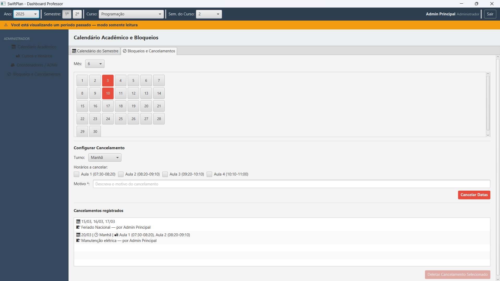
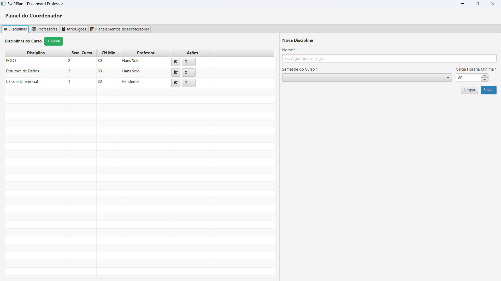
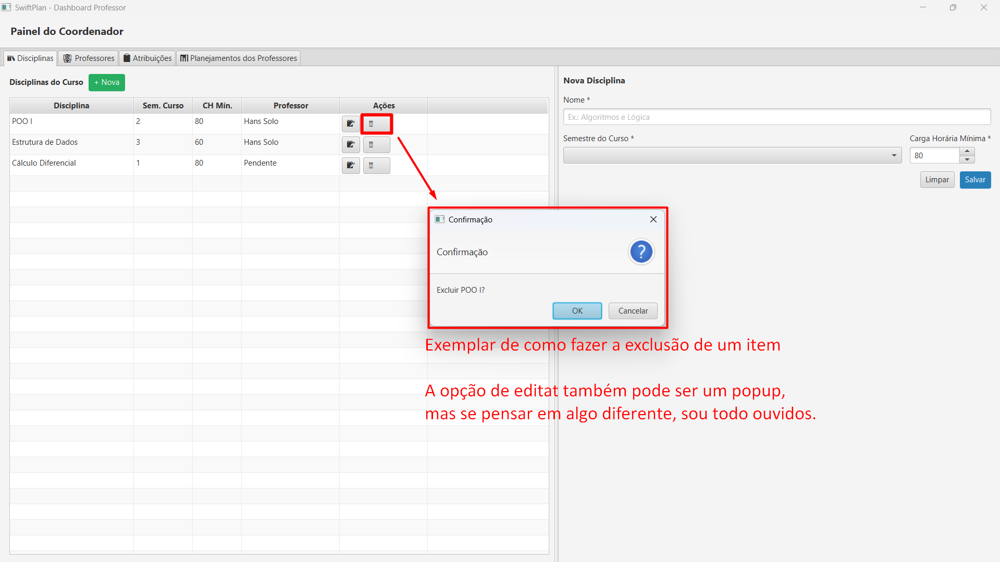
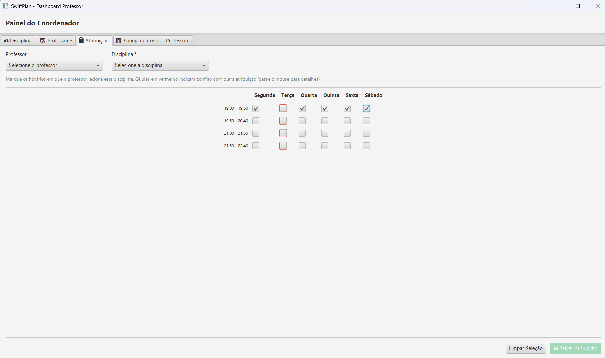
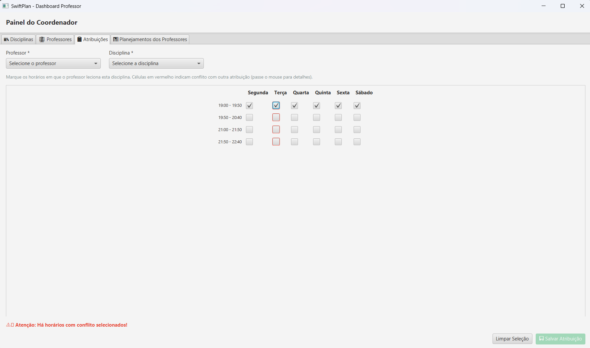
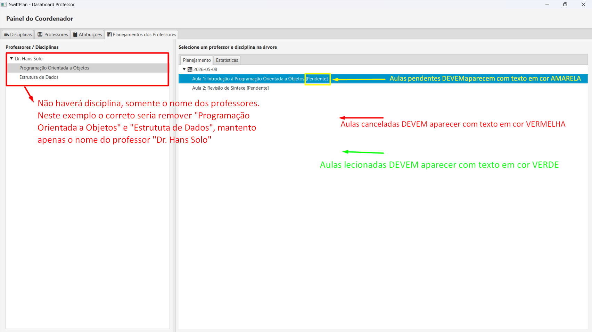
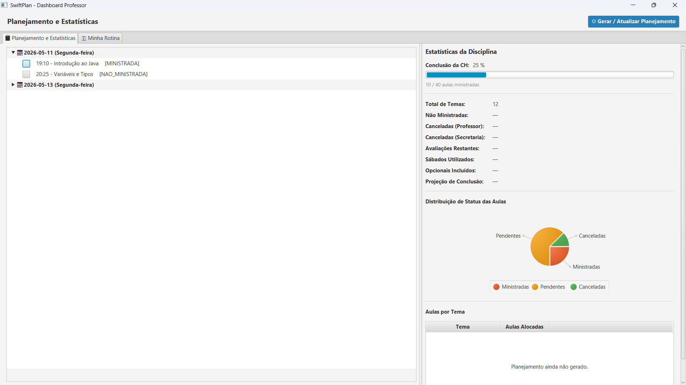
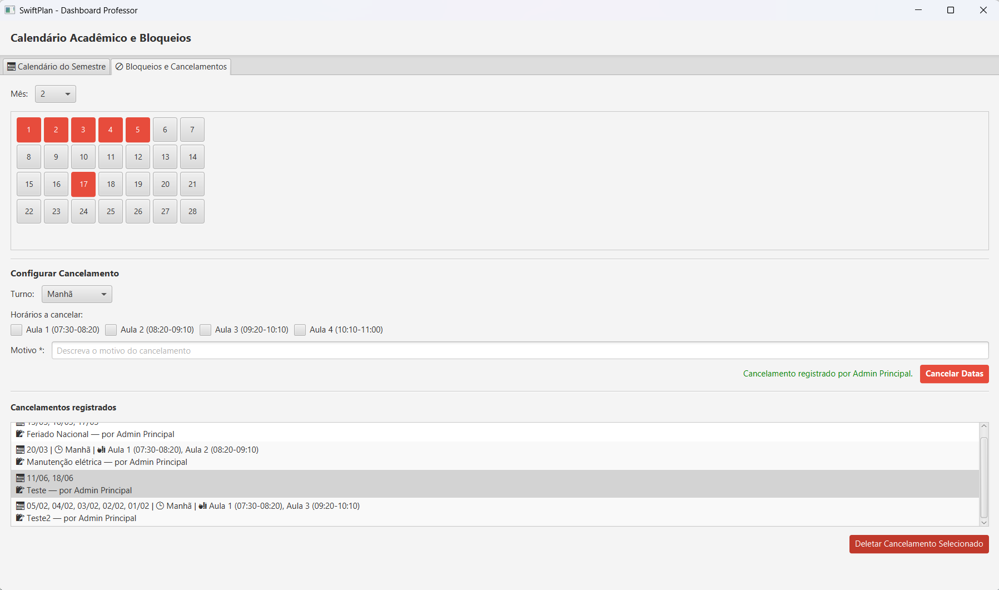
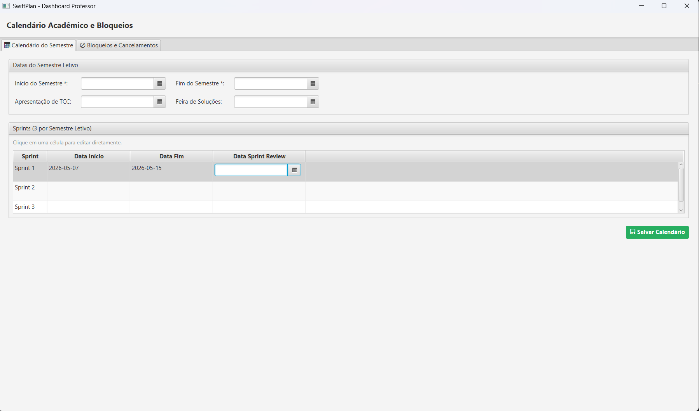
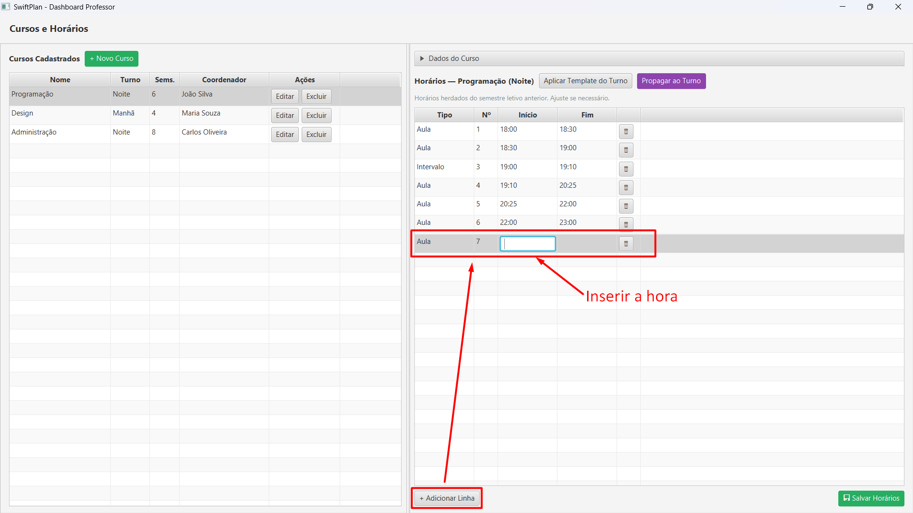

Este documento serve **APENAS** como guia técnico e funcional para orientar o desenvolvimento das *User Stories* da **Sprint 3**, utilizando os protótipos de interface (GUIs) como referência visual para o comportamento esperado do sistema.

---

# Guia de Referência de Interface e UX – Sprint 3

**Objetivo:** Padronizar a implementação das funcionalidades de coordenação, administração e planejamento, minimizando ambiguidades técnicas.

---

## 1. Visão Geral e Navegação (Dashboard Principal)

A interface segue um padrão de painel administrativo com foco em usabilidade e feedback de estado.

<table>
  <tr>
    <td valign="top">
  </tr>
</table>

* **Controles Superiores:** Filtros globais para Ano, Semestre, Curso e Semestre do Curso.
* **Feedback de Estado:** Caso o usuário acesse dados de períodos encerrados, deve ser exibido um banner de alerta (ex: cor laranja) indicando o **"Modo Somente Leitura"**.
* **Barra Lateral:** Navegação persistente por ícones e textos para acesso rápido às funcionalidades (Calendário, Cursos, Atribuições, etc.).
* **Identificação:** Canto superior direito reservado para perfil do usuário logado e botão de saída (*Logout*).

---

## 2. Painel do Coordenador

### 2.1 Gestão de Disciplinas (CRUD)

<table>
  <tr>
    <td valign="top">
    <td valign="top">
  </tr>
</table>

* **Layout Dinâmico:** A tabela de disciplinas ocupa a largura total por padrão. Ao clicar em **"+ Nova"**, o formulário lateral de cadastro deve ser exibido, redimensionando a tabela.
* **Ações de Linha:** Cada disciplina possui ícones para Editar e Excluir.
* **Confirmação de Exclusão:** Toda tentativa de remoção deve disparar um *pop-up* (modal) de confirmação com os botões "OK" e "Cancelar" para evitar deleções acidentais.

### 2.2 Atribuição de Carga Horária e Conflitos

<table>
  <tr>
    <td valign="top">
    <td valign="top">
  </tr>
</table>

* **Grade de Atribuição:** Interface baseada em *checkboxes* dividida por horários e dias da semana (Segunda a Sábado).
* **Tratamento de Conflitos:**
* Horários já atribuídos por outros coordenadores devem aparecer com **borda vermelha** e bloqueados para seleção.
* Caso haja seleção inválida, o sistema deve exibir uma mensagem de erro no rodapé: *"Atenção: Há horários com conflito selecionados!"*.

* **Persistência:** Botão de "Salvar Atribuição" destacado no rodapé.

### 2.3 Visualização de Planejamento (Monitoria)

<table>
  <tr>
    <td valign="top">
  </tr>
</table>

* **Hierarquia de Seleção:** O coordenador deve visualizar a lista de professores.
* **Ajuste de UI Importante:** Diferente do protótipo inicial, a árvore lateral deve exibir **apenas o nome dos professores**, removendo os nomes das disciplinas debaixo do professor para simplificar a navegação.
* **Sinalização por Cores (Status das Aulas):**
* **AMARELO:** Aulas Pendentes.
* **VERDE:** Aulas Lecionadas.
* **VERMELHO:** Aulas Canceladas.

---

## 3. Painel do Professor

### 3.1 Planejamento e Estatísticas de Aula

<table>
  <tr>
    <td valign="top">
  </tr>
</table>

* **Cronograma (Esquerda):** Lista expansível por data e dia da semana. Ao expandir, exibe-se o horário, o tema da aula e o status (ex: [MINISTRADA], [NAO_MINISTRADA]).
* **Painel de Métricas (Direita):**
* Barra de progresso de conclusão da Carga Horária (CH).
* Dados quantitativos (Total de temas, avaliações restantes, faltas, etc.).
* **Gráfico de Status:** Gráfico de pizza (Donut ou Pie) para visualização rápida da distribuição de aulas ministradas, pendentes e canceladas.

---

## 4. Painel Administrativo (Configurações Globais)

### 4.1 Calendário Acadêmico e Bloqueios

<table>
  <tr>
    <td valign="top">
  </tr>
</table>

* **Seleção de Data:** Interface de calendário onde o administrador seleciona os dias.
* **Lógica de Cancelamento:**
1. Seleciona o mês no filtro superior.
2. Clica na data desejada (os botões mudam de estado visual).
3. Define o Turno. **Importante:** Se o turno não for selecionado, o bloqueio é assumido para o dia inteiro. Se o turno for selecionado, os horários específicos aparecem para marcação obrigatória.

* **Código de Cores do Calendário:**
* **Vermelho:** Dia já cancelado/bloqueado.
* **Amarelo:** Seleção atual em processo (não confirmada).
* **Borda Avermelhada:** Indicação para reverter/excluir um bloqueio existente.

* **Log de Registro:** Lista inferior detalhando todos os cancelamentos efetuados, incluindo o motivo e quem realizou a ação.

### 4.2 Cadastro de Sprints e Semestre

<table>
  <tr>
    <td valign="top">
  </tr>
</table>

* **Datas do Semestre:** Campos de data para início/fim do semestre e eventos fixos (TCC, Feira de Soluções).
* **Gestão de Sprints:** Tabela fixa com 3 linhas (Sprint 1, 2 e 3). A edição ocorre por clique duplo na célula para inserção da data de início, fim e data da *Review*.

### 4.3 Gestão de Cursos e Templates de Horários

<table>
  <tr>
    <td valign="top">
  </tr>
</table>

* **Tabela de Cursos:** Listagem com filtros e ações de edição/exclusão.
* **Configuração de Horários:**
* Permite adicionar linhas para definir o tipo (Aula/Intervalo), número da aula, início e fim.
* **Funcionalidade de Automação:** Botão "Aplicar Template do Turno" (recupera configurações padrão) e "Propagar ao Turno" (replica o cronograma atual para outros cursos do mesmo período).
* **Interatividade:** Botão de lixeira para exclusão rápida de linhas de horário.

---

### Notas Finais para o Desenvolvimento:

* Priorizar a implementação do feedback visual (cores de status e alertas de erro).
* Garantir que todas as exclusões de dados sensíveis (cursos, disciplinas, horários) possuam o modal de confirmação.
* Seguir rigorosamente a lógica de cores estabelecida para o calendário e para o planejamento dos professores.
